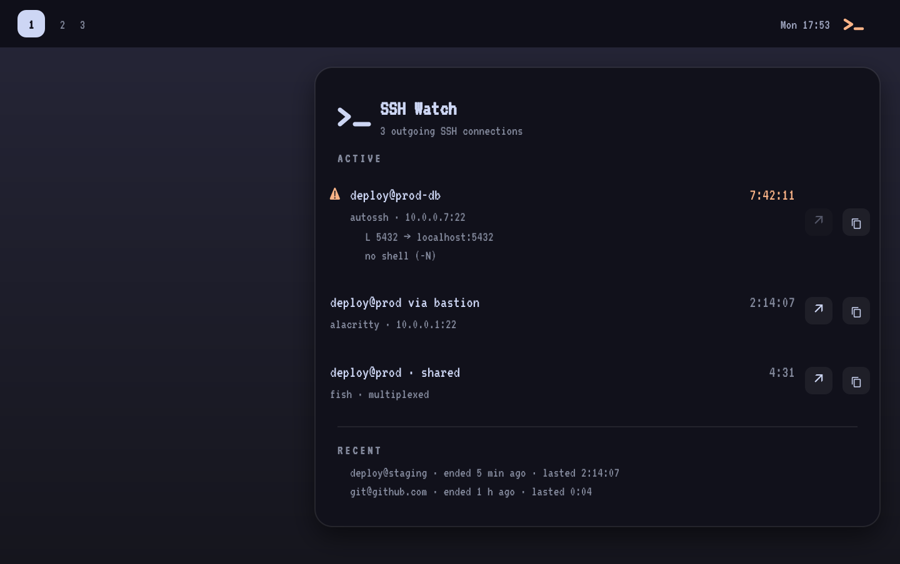

# SSH Watch for Omarchy

An Omarchy shell plugin that shows the SSH connections going *out* of this machine: where they go,
who opened them, what they tunnel, and how long they have been up. A colour-coded bar icon warns
when a session has been open longer than you probably meant it to be.



> Status: in development. See [AGENTS.md](AGENTS.md) for the build roadmap.

## Features

- **Bar icon, colour-coded** — dim when nothing is connected, normal while sessions are up, amber
  when one has outlived your threshold, red if the plugin cannot read what it needs. No hostnames
  on the bar, so nothing leaks into a screenshot or a screen share.
- **Count and detail on hover** — the tooltip lists every open session with its destination and
  running time without opening anything.
- **Reads processes, not port 22** — sessions are found by looking at your own `ssh` processes, so
  a host on port 2222 is seen just as well as one on 22, and the duration is the process's real
  start time rather than a guess.
- **Names you actually typed** — `ssh prod-web-01` shows as `deploy@prod-web-01`, resolved through
  OpenSSH's own config parser, with the peer IP underneath. Your `~/.ssh/config` aliases,
  `Match` blocks and `Include`s are honoured because OpenSSH resolves them, not us.
- **Knows who opened it** — each row names the owning process: your terminal, `git`, `code`,
  `rsync`, `autossh`. Your shell session is distinguishable from a background tunnel at a glance.
- **Understands jump hosts and multiplexing** — `ssh -J bastion prod` shows as one row,
  `prod via bastion`, not two confusing ones. Extra sessions riding an existing ControlMaster are
  marked `shared` instead of vanishing.
- **Shows what a tunnel holds** — `-L`, `-R` and `-D` forwards are listed per row, so the amber
  warning tells you *which* local port is still occupied and by what.
- **Stale-session warning** — configurable; the forgotten `-N -f` tunnel and the root shell you
  opened this morning stop being invisible.
- **Recent section** — the last few sessions that ended, with how long they lasted, so you notice
  a tunnel that is no longer up. Kept in memory only, cleared when the shell restarts.
- **Jump to the terminal** — a row can focus the window holding that session, so you stop hunting
  through twelve terminals for the one that is on prod.
- **Read-only by design** — the plugin never signals, kills, or opens a connection.
- **Multi-monitor safe** — one shared background service scans; every bar shows the same state.

## Requirements

- Omarchy with Quickshell plugin support (`omarchy plugin --help` works).
- `python3` (present on a stock Omarchy install). No pip packages are used.
- OpenSSH's `ssh` binary — used with `-G` to resolve host aliases.
- `hyprctl` — optional. Without it everything works except the focus-window action.

No SSH server, no configuration, no credentials, and no network access are required.

## Installation

```bash
omarchy plugin add https://github.com/CHANGEME/omarchy-sshwatch.git --enable
```

From a local checkout:

```bash
omarchy plugin add ~/Projects/omarchy-plugins/omarchy-sshwatch --enable
```

Pick the bar section when Omarchy asks; the manifest defaults to the right-hand section.

There is nothing to configure to get started. The icon works immediately.

## Configuration

All preferences live in Omarchy's own plugin settings for the widget. **The plugin owns no file on
disk.**

| Setting | Default | Range | Meaning |
|---|---|---|---|
| Refresh interval (seconds) | 5 | 2–60 | How often processes are scanned |
| Minimum age (seconds) | 3 | 0–60 | Sessions younger than this are hidden, so a one-second `git fetch` never flickers the bar. `0` shows everything |
| Stale after (hours) | 4 | 0–48 | A session older than this turns the icon amber. `0` disables the warning |
| Recent entries | 5 | 0–20 | Rows in the Recent section. `0` hides it |
| Show port forwards | on | — | List `-L` / `-R` / `-D` forwards under each row |

Durations are not recomputed on every scan — the plugin records each session's absolute start time
and ticks the clock locally once a second, so a five-second refresh interval still shows a smooth
running time.

## Usage

| Input | Action |
|---|---|
| Left click | Open / close the panel |
| Middle click | Rescan now |
| `Esc` | Close the panel |
| `r` | Rescan |
| Arrow keys | Move through rows |
| `Enter` | Focus the terminal window holding the selected session |
| `y` | Copy `ssh <target>` for the selected session |

### Reading a row

```
 ⚠ deploy@prod-db                     7:42:11
   autossh · 10.0.0.7:22
   L 5432 → localhost:5432
   no shell (-N)

   deploy@prod  via bastion           2:14:07
   alacritty · 10.0.0.1:22

   deploy@prod  · shared                 4:31
   fish · multiplexed
```

- **`via <host>`** — a jump host. `ssh -J bastion prod` is one session through one hop; the socket
  physically goes to `bastion`, the session is with `prod`, and the row says both.
- **`shared` / `multiplexed`** — this session rides an existing ControlMaster connection. It has no
  TCP socket of its own, which is why no peer address is shown. It is a real session.
- **`no shell (-N)`** — a pure port forward with no remote command. These are the ones that get
  forgotten, so they are labelled.
- **`⚠`** — older than your stale threshold.

Focus-window is unavailable, and shown greyed out, when the session's owner chain does not end in a
window: `tmux` sessions, VS Code Remote, `autossh`, and anything started by systemd.

## Scope

`omarchy-sshwatch` shows **outgoing** connections only — the SSH clients *you* are running.

It deliberately does not show incoming sessions (who is logged into this machine). Those belong to
`sshd` and run as root; reading them properly needs privileges this plugin does not want and will
never ask for. If you need that, `who` and `journalctl -u sshd` are the right tools.

It is also not a session manager, not a Waybar module, and not a connection log — see
[AGENTS.md](AGENTS.md) for the full non-goals.

## Privacy and security

- **No network access.** The plugin makes no connections of its own, to anything, ever. It reads
  kernel state about processes that already exist.
- **No files written.** Nothing about your hosts, sessions, or history is persisted. The Recent
  list lives in the shell process's memory and is gone when the shell restarts.
- **Own user only.** Only processes owned by your UID are examined. Other users' SSH sessions,
  including root's, are not read and not shown.
- **Raw command lines are never displayed.** A wrapper such as `sshpass -p <password> ssh host`
  puts a plaintext password in the parent process's command line. The plugin reads the parent's
  `comm` (the bare program name, `sshpass`) and never its `cmdline`, and never renders a raw
  command line anywhere in the UI. From the `ssh` process's own command line it extracts only the
  target and the forward flags — no `-o` options, no `ProxyCommand`, no paths.
- **`ssh -G` runs your own config.** Host aliases are resolved by invoking `ssh -G <target>`, which
  is OpenSSH's real parser. If your `~/.ssh/config` contains `Match exec "<command>"` directives,
  that command runs — as it does whenever you use `ssh` normally. Results are cached per target, so
  it happens once per host rather than once per refresh, but if you keep expensive or
  side-effecting `Match exec` blocks in your config you should know this.
- **What the plugin reads:** `/proc/<pid>/{comm,cmdline,stat,fd}` for your own processes,
  `/proc/net/tcp` and `/proc/net/tcp6`, `/proc/uptime`. What it runs: `ssh -G <target>` and, when
  present, `hyprctl clients -j` plus `hyprctl dispatch focuswindow` on your explicit action.
- **Hostnames are panel-only.** The bar shows a colour, never a destination.

## Troubleshooting

Run the helper by hand to see the raw answer:

```bash
~/.config/omarchy/plugins/io.github.CHANGEME.sshwatch/bin/omarchy-sshwatch status | jq
```

| Symptom | Cause |
|---|---|
| Icon dimmed but you are connected | The session is younger than **Minimum age**, or its `ssh` process belongs to another user. Try `minAgeSec: 0`. |
| A connection is missing entirely | The client is not OpenSSH. Go, Java and Rust SSH libraries — `terraform`, some `gh` paths, JetBrains — never spawn an `ssh` process, so there is nothing to find. This is a known limit. |
| `mosh` sessions never appear | Mosh runs over UDP after its initial handshake. Only the brief `ssh` bootstrap is visible. Not supported. |
| Row shows an IP instead of your alias | `ssh -G` could not resolve the target, usually because you connected by IP in the first place. |
| Wrong user shown on a row | `ssh -G` reports the *effective* config. If you overrode the user with `-l` or `-o User=`, the row follows your `~/.ssh/config` instead. Known limit. |
| Focus-window greyed out | The session's owner is `tmux`, VS Code, `autossh`, or a systemd unit — there is no window to focus. |
| Focus-window does nothing anywhere | `hyprctl` is missing or not on `PATH`. Check `hyprctl clients -j \| head`. |
| `"lastError": "cannot read /proc"` | Unusual; a hardened kernel with `hidepid=2` will hide processes even from their owner in some configurations. |
| Icon missing entirely | `omarchy plugin validate ~/.config/omarchy/plugins/io.github.CHANGEME.sshwatch` |

## Updating

```bash
omarchy plugin update io.github.CHANGEME.sshwatch
```

## Removal

```bash
omarchy plugin remove io.github.CHANGEME.sshwatch
```

Nothing is left behind — the plugin writes no configuration or cache files.

## Related

- [omarchy-activity-monitor](https://github.com/stappmus/omarchy-activity-monitor) — CPU, RAM and
  disk for the Omarchy bar. Complementary; it does not cover network or SSH.
- [omarchy-pihole](https://github.com/CHANGEME/omarchy-pihole) — sibling plugin, same architecture.

## Licence

MIT.
